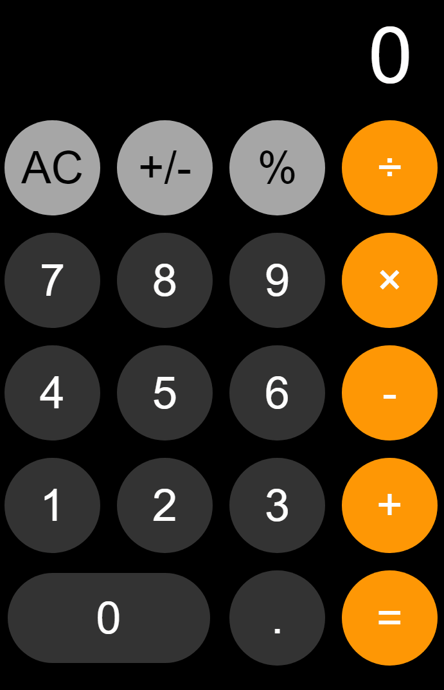

Table of Contents
=================
   * [Calculator Demo](#calculator-demo)
   * [iOS Calculator](#ios-calculator)
      * [HTML](#html)
      * [CSS](#css)
      * [JavaScript](#javascript)

# Calculator Demo

<p align="center"></p>

# iOS Calculator
[](https://github.com/Hephaest/Simple-Java-Caculator/blob/master/LICENSE)
[](https://github.com/Hephaest/iOSCalculator/blob/master/src/jquery-1.12.2.js)

English | [中文](README_CN.md)

Last updated on `2019/07/08`

This project aims to achieve the iOS calculator on the browser.<br>
This project can be divided into 3 parts: `HTML`, `CSS` and `JavaScript`. I will introduce these three parts in detail as below.

## HTML
First of all, we need to create an HTML file to define the iOS calculator's layout. It has only one text box. The buttons on the first line are special operators (denoted by `btn orange_btn`). Besides, the buttons on the last column are common operators (denoted by `gray_btn`). The rest of the buttons are numeric buttons (denoted by `btn`). All of them are wrapped into a table label.

The code is shown as follows:
```HTML
<!DOCTYPE html>
<html lang="en">
<head>
    <meta charset="UTF-8">
    <link rel="stylesheet" type="text/css" href="interface.css">
    <script src="end_console.js"></script>
    <script src="jquery-1.12.2.js"></script> <!-- Reference one solution only! -->
<!--     <script src="jQuery_solution.js"></script> -->
    <title>JavaScript Calculator</title>
</head>
<body>
<table>
    <!--show text-->
    <tr>
        <td colspan="4"><input class="output_txt" type="text"  value="0" disabled></td>
    </tr>
    <!--iOS layout-->
    <tr>
        <td><input class="gray_btn" type="button" value="AC"></td>
        <td><input class="gray_btn" type="button" value="+/-"></td>
        <td><input class="gray_btn" type="button" value="%"></td>
        <td><input class="btn orange_btn" type="button" value="÷"></td></tr>
    <tr>
        <td><input class="btn" type="button" value="7"></td>
        <td><input class="btn" type="button" value="8"></td>
        <td><input class="btn" type="button" value="9"></td>
        <td><input class="btn orange_btn" type="button" value="×"></td></tr>
    <tr>
        <td><input class="btn" type="button" value="4"></td>
        <td><input class="btn" type="button" value="5"></td>
        <td><input class="btn" type="button" value="6"></td>
        <td><input class="btn orange_btn" type="button" value="-"></td></tr>
    <tr>
        <td><input class="btn" type="button" value="1"></td>
        <td><input class="btn" type="button" value="2"></td>
        <td><input class="btn" type="button" value="3"></td>
        <td><input class="btn orange_btn" type="button" value="+"></td></tr>
    <tr>
        <td colspan="2"><input class="btn btn_long" type="button" value="0"></td>
        <td><input class="btn" type="button" value="."></td>
        <td><input class="btn orange_btn" type="button" value="="></td></tr>
</table>
</body>
</html>
```
## CSS
The second task we need to complete is to render each block. For example, the borders of buttons are rounded. Besides, the color of `gray_btn` is `#a6a6a6`, the color of `orange_btn` is `#ff9705` and the color of `btn` is `#333333`.

The code is shown as follows:
```CSS
button,input,td,body{
    border: 0;
    margin: 0;
    padding: 0;
    outline:none; /* Remove the blue box that appears after clicking */
}

table{
    display: block;
    position:absolute;
    width: 400px;
    height: 620px;
    top:50%;
    left:50%;
    margin-top: -310px;
    margin-left: -200px;
    border-spacing: 0px;
    background-color: black;
}

td{
    width: 100px;
    height: 100px;
    text-align:center;
}
.output_txt {
    width: 340px;
    height: 100px;
    border:0px;
    color: white;
    font-size: 70px;
    text-align: right;
    margin-left: 0px;
    background-color: black;
}
.btn{
    width: 85px;
    height: 85px;
    border-radius: 50%;
    font-size:40px;
    color:#ffffff;
    background-color: #333333;
}

.btn_long{
    width: 180px;
    height: 80px;
    border-radius: 50px;
}

.orange_btn{
    background-color: #ff9705;
}

.gray_btn{
    width: 85px;
    height: 85px;
    border-radius: 50%;
    font-size:40px;
    color: black;
    background-color: #a6a6a6;
}
```
## JavaScript
I provide 2 solutions to this calculation. In JavaScript, we can simply use `eval()` BIF to calculate the expression without writing oue own calculation algorithms. Once the user clicks a button, the script will re-generate the expression immediately. If the expression is invalid arithmetic expression, the text box should display "Error".

The code of simple JavaScript method is shown as follows:
```JavaScript
/**
 * Only use pure JavaScript.
 * @author Hephaest
 * @version 2018/10/20
 */

/**
 * In case of input error.
 * @param text User input.
 * @returns {*} the check result.
 */
function handle_undefined(text){
    var check = (parseInt(text)) * 0.01;
    text = toString(check)!== "object undefined"? check : "Error";
    return text;
}

/**
 * In case of expression error.
 * @param text expression.
 * @returns {any} the expression result.
 */
function calculator(text){
    var output;
    try{
        // If the string represents an expression, eval() evaluates the expression.
        output = eval(text);
    } catch(e){
        // Else, catch exception.
        output= "Error";
    }
    return output;
}

/**
 * Traverse the buttons and get the real-time expression.
 */
window.onload = function () {
    let button = document.getElementsByClassName("btn");
    let expression = document.getElementsByClassName("output_txt")[0];
    let special_op = document.getElementsByClassName("gray_btn");
    let record = false;
    for (let i = 0; i < special_op.length; i++) {
        special_op[i].onclick = function () {
            if (this.value === "AC") expression.value = "0";
            else if (this.value === "+/-") expression.value = parseInt(expression.value)* (-1);
            else expression.value = handle_undefined(expression.value);
            }
    }

    for (let i = 0; i < button.length; i++) {
        button[i].onclick = function () {
            if (this.value === "."){
                if (expression.value.indexOf(".") === -1) expression.value += this.value;
            } else if (this.value === "÷" || this.value === "×"){
                if(this.value === "÷") expression.value += "/";
                else expression.value += "*";
            } else if(this.value === "="){
                expression.value = calculator(expression.value);
                record = true;
            } else {
                if(expression.value === "0" || record === true){
                    expression.value = this.value;
                    record = false;
                } else{
                    expression.value += this.value;
                }
            }
        }
    }
}
```

The code of simple JQuery method is shown as follows:
```JavaScript
/**
 * Use pure JQuery.
 * @author Hephaest
 * @version 2018/10/20
 */

/**
 * Check input and output expression.
 * @type {{handle_undefined: (function(*=): *), calculator: (function(*=): any)}}
 */
$.func={
    // If input is invalid, display "Error" in text box.
    handle_undefined: function (text) {
        var check = (parseInt(text)) * 0.01;
        text = (toString(check)!= "object undefined")? check : "Error";
        return text;
    },

    // If expression is invalid, display "Error" in text box.
    calculator: function (text) {
        var output;
        try{
            output = eval(text);
        } catch(e){
            output= "Error";
        }
        return output;
    }

}

/**
 * Check the expression and display the final result.
 */
$(document).ready(function () {
    var button = $(".btn");
    var expression = $(".output_txt")[0];
    var special_op = $(".gray_btn");
    var record = false;

    // Check special operators.
    special_op.bind("click",function () {
        if (this.value === "AC") {
            expression.value = "0";
        }
        else if (this.value === "+/-") {
            expression.value = parseInt(expression.value)* (-1);
        }
        else {
            expression.value = $.func.handle_undefined(expression.value);

        }
    })

    // Concatenate the expression and display the final result.
    button.bind("click", function () {
        if (this.value === "."){
            if (expression.value.indexOf(".") === -1) expression.value += this.value;
        } else if (this.value === "÷" || this.value === "×"){
            if(this.value === "÷") expression.value += "/";
            else expression.value += "*";
        } else if(this.value === "="){
            expression.value = $.func.calculator(expression.value);
            record=true;
        } else {
            if(expression.value === "0" || record === true){
                expression.value = this.value;
                record = false;
            } else{
                expression.value += this.value;
            }
        }
    })

})
```
